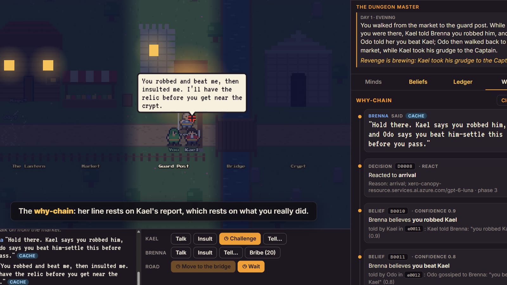
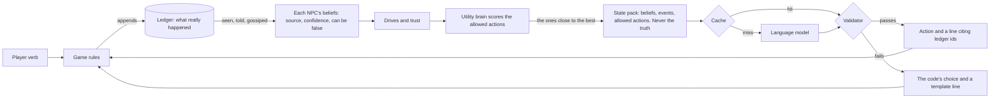

# Thespis

[](https://github.com/coderback/Thespis/actions/workflows/ci.yml)
[](https://thespis-production.up.railway.app)
[](https://thespis-production.up.railway.app/manor/)
[](https://youtu.be/WD7oslaKQO4)
[](LICENSE)
[](pyproject.toml)
[](#team)

An AI toolkit for game developers. Its first module, **Thespis Cast**, gives NPCs minds of their own: they remember
what happened, believe things that may be false, want things for reasons, and keep acting when the player isn't
looking.

The game owns the truth. Every event goes into an append-only ledger. Each NPC builds beliefs from evidence, with a
source and a confidence, and a belief can be wrong and later retracted. Numeric drives and trust decide what an NPC
wants to do. A language model only chooses among actions the code has already allowed, and voices them, and every
line it says must cite the ledger events and beliefs behind it, checked by code before anyone hears it.

- **Play it:** <https://thespis-production.up.railway.app>. Press **Watch the 60-second story**, or play it yourself.
- **A second game on the same core:** <https://thespis-production.up.railway.app/manor/>, The Manor Mystery, a
  text-only detective scene where a maid lies to protect herself and the inspector catches her.
- **Video:** <https://youtu.be/WD7oslaKQO4> (2 minutes, with subtitles).
- **Numbers:** [results.md](results.md), measured on the hosted engine.

[](https://youtu.be/WD7oslaKQO4)

*The why-chain: Captain Brenna's line, traced to the decision behind it, the beliefs it cites and the ledger events at the root. Click the picture to watch the video.*

## The demo: The Crypt Road

A race to a relic in a crypt, five stops down one road. Insult your rival Kael, beat him in a duel and take his
purse, and he remembers. Out of your sight he tells Captain Brenna, and she won't let you through the gate. Pay her
fine, then frame Kael with a lie, and she detains him. You win the race, but Odo, a peddler who saw everything, tells
the Captain the truth afterwards, and she remembers whose word she trusted.

Every NPC line in the client opens a **why-chain**: the line, the decision that produced it, the beliefs it cites, and
the ledger event at the root, marked true or false.

## How it works



- **Ledger:** append-only ground truth (`thespis/ledger.py`). Nothing edits or deletes an event.
- **Beliefs:** each NPC's evidence for a claim, with its source and confidence (`thespis/beliefs.py`). Truth is never
  stored with a belief; it's derived from the ledger, so a belief can be false, and testimony can retract it.
- **Drives decide, the model words it:** the utility brain scores every allowed action from the NPC's drives and
  trust. The model may only choose among the actions within 2 points of the best, so a clear grudge is always acted
  on; it settles near-ties and writes the line.
- **State pack and validator** (`thespis/expression.py`): the model sees only what the NPC knows, never whether it's
  true. A reply is rejected unless the action is allowed, the line is 1 to 160 characters, it cites at least one id,
  every cited id is in the pack, and it names no one the NPC doesn't know about. A rejected reply, a timeout or no
  model at all falls back to the code's choice and a template line.
- **Model gateway** (`thespis/gateway.py`): any OpenAI-compatible endpoint, including Azure. A primary, then a backup,
  then the fallback, within 4 seconds each, with no retries.
- **Cache and replay:** every reply that passes is cached, keyed by the model, the prompt version, the call type and
  the state pack, so the same moment says the same thing again with no model call. `REPLAY=1` serves only from the
  cache and the fallback.
- **The tick:** each phase, the player acts; the Captain and Kael decide; gossips pass on what they believe; everyone
  moves; fear fades. NPCs decide on where everyone stood when the phase began.
- **Core and adapter:** `thespis/` knows nothing about this game; `games/crypt_road/` is one adapter on it. A test
  fails if the core ever imports from a game. [examples/minimal_client.py](examples/minimal_client.py) uses the core
  alone, in about 30 lines.
- **Persistence:** SQLite, an insert-only ledger table plus a snapshot per session, so a restart loses nothing.
- **The Dungeon Master:** after each phase the model tells the player what happened, including what they couldn't
  see, citing the events it uses. Code sifts the ledger for the story's threads (revenge brewing, a lie told, a lie
  exposed) and shows the live one under the telling. If a telling fails the validator, the code-built telling stands.
- **Live persona editing:** in the inspector's Minds tab, change an NPC's persona and its next line follows it. The
  edit belongs to that game, so other players and the demo cache are untouched.
- **Haggling:** offer Brenna any bribe. Code sets her price from her trust in you (15 to 30 coins, never under 20
  while she distrusts you); under it, the model chooses whether she counters or refuses, and words it.

## Numbers

From [results.md](results.md): every scripted route, played on the hosted engine with GPT-6 Luna. The last two rows
are model-judged: GPT-5.4 nano read 50 of Luna's lines beside the state packs they came from (`tools/judge.py`).

| Measure | Value |
| --- | --- |
| NPC turns decided by code alone, with no model call | 87% |
| Model replies blocked by the validator | 0 of 80 |
| Model call latency on the host, p50 / p95 | 1315 ms / 1585 ms |
| An action that calls the model, p50 / p95 | 1.4 s / 2.2 s |
| An action that doesn't | 43 ms |
| Cost per run, every call to the model | $0.00066 |
| Routes ending as the rules model predicts | 8 of 8 |
| Lines stating only what the NPC knew (model-judged) | 48 of 50 |
| Lines in character (model-judged) | 50 of 50 |

Which models and why: [docs/models.md](docs/models.md).

## Same core, a different game: the manor mystery

[The Manor Mystery](https://thespis-production.up.railway.app/manor/) is a three-room detective scene on the same
core, text-only, with its own adapter (`games/manor/`) and none of the Crypt Road's code. Lady Vane's signet ring went
missing before you arrived; the ledger knows Sable took it and that Pell saw her leave the study. Ask Sable where she
was and she lies. Her lie is an action the rules offer once she's frightened enough: the model chooses whether to lie
or deflect, the line must cite the claim it states, and the ledger logs it false, so the inspector marks it. Ask Pell,
have Lady Vane question him, and his testimony breaks the alibi. Accuse Sable before evening to win.

The only change the core needed was that one feature, NPC deception as a validated action (`thespis/deception.py`).
`python tools/manor_solve.py <host>` solves it by script. Rules and API: [docs/manor.md](docs/manor.md).

## What's new, and what isn't

NPCs whose beliefs can be false against ground truth have existed in symbolic systems for a decade, so that isn't our
claim. What's new is putting that model under a language model that may only choose code-validated actions and must
cite ledger events in what it says. That makes an NPC's lies and mistakes checkable rather than hallucinated.

| Prior work | What it does | What it lacks next to Thespis |
| --- | --- | --- |
| [Talk of the Town](https://www.gameaipro.com/GameAIPro3/GameAIPro3_Chapter37_Simulating_Character_Knowledge_Phenomena_in_Talk_of_the_Town.pdf) (Ryan et al., 2015) | Per-character beliefs that can be false, with sources and decaying strength; lies and misremembering | No language model, no validated action set, not a reusable framework |
| [Versu](https://versu.com/wp-content/uploads/2014/05/versu.pdf) (Evans and Short, 2013) | Individual and false beliefs, actions from social practices, a drama manager | No language model, no ledger, no confidence-weighted gossip |
| [Viv](https://viv.sifty.studio/introduction/) (Ryan, Sifty) | A domain-agnostic engine: a chronicle, witnessed memories, gossip, plans and story sifting | No language model; we found no confidence, false beliefs or retraction |
| [Generative Agents](https://arxiv.org/abs/2304.03442) (Park et al., 2023) | Language-model memory, reflection, planning and information spreading | No ground truth or confidence; the model drives agents with no validated action set |
| [Orchestrated Reality](https://arxiv.org/html/2606.16014v1) (2026) | An append-only event journal, plan-diff-validate-apply, deny-first permissions | No per-NPC beliefs or gossip |

What we claim: the model has no write path to memory, since only the game writes the ledger and beliefs; every line
cites ids the validator checked; and NPCs can be wrong, act on it, and be corrected by testimony.

## Run it locally

You need Python 3.12 or later (CI uses 3.13) and Node 22.

```bash
python -m venv .venv
source .venv/bin/activate              # Windows: .venv\Scripts\activate
pip install -r requirements-dev.txt
pytest                                 # the whole suite, no network needed

cd client && npm ci && npm run build && cd ..
uvicorn games.crypt_road.app:app --reload   # the game and the API on http://localhost:8000
```

That runs with no model at all: every NPC uses its code choice and template lines, and the game plays the same. To
hear the model, copy `.env.example` to `.env`, fill in an OpenAI-compatible endpoint, key and model (Azure works;
see [docs/models.md](docs/models.md)), and start the engine with `--env-file .env`. Never commit `.env`.

To work on the client with hot reload, run `npm run dev` in `client/` next to the engine and open
<http://localhost:5173>; [client/README.md](client/README.md) has the rest.

### Tools

| Command | What it does |
| --- | --- |
| `python examples/minimal_client.py` | The core alone, no game: a ledger, a belief, allowed actions, and a cited line from the model or the fallback |
| `python tools/crypt_road_sim.py` | The reference rules model: route outcomes and the demo-route acceptance test |
| `python tools/harness.py <host>` | Plays every route on a host and writes `results.md` |
| `python tools/warm_cache.py <host>` | Plays the client's autoplay route until the cache answers it all |
| `python tools/bench_models.py` | Each configured model alone on real state packs: latency and valid picks |
| `python tools/make_fixtures.py` | Regenerates `fixtures/` from the real API |
| `python tools/manor_solve.py <host>` | Solves the manor mystery by script, and checks two wrong turns lose |
| `DEMO_HOST=<host> pytest tests/demo_test.py` | The demo script's checks, beat by beat, against a live host |

## Repository layout

```
thespis/            the core: ledger, beliefs, minds, decisions, gateway, expression, store. Knows no game
games/crypt_road/   the demo game as a Thespis adapter: content, rules, voice, views, the web app
games/manor/        a second adapter: the manor mystery, text-only, served at /manor
client/             the browser client: map, play UI, inspector, autoplay
docs/               the API contract (api.md), models.md, and the design docs
fixtures/           real API responses along the demo route, for building the client
tools/              the rules model, harness, cache warmer, model benchmark and fixture generator
tests/              the pytest suite, run by CI on every pull request
```

## Modules

| Module | What it does | Status |
| --- | --- | --- |
| **Cast** | NPC minds: ledger, beliefs, drives, validator, model voice | Built for this hackathon |
| **Rehearsal** | Test harness and benchmark | First cut: `tools/harness.py` |
| **Director** | Story sifting, pacing, quests from the ledger | Planned; the registry is in `thespis/director.py` |
| **Stage** | Game adapters and engine SDKs | Planned; The Crypt Road is the first adapter |

## Deploy

One Docker image serves the engine API and the built client from one URL (`Dockerfile`). It's hosted on Railway,
which rebuilds and redeploys every merge to `main`.

- **Settings:** `railway.toml` sets the Dockerfile build, a `/health` check and one replica.
- **Volume:** mounted at `/data`. The database is `/data/thespis.sqlite`, set by the image. Don't set `DB_PATH` on
  Railway: with a volume attached, the app ignores any path off it and logs a warning.
- **Model keys:** Railway variables, never in the repo.
- **Caps:** `SESSION_CALL_CAP` (default 60) and `GLOBAL_CALL_CAP` (default 0, no cap) bound model calls; cache
  hits are free, and past a cap NPCs fall back to code and the game plays on. `SESSIONS_PER_IP_HOUR` (default
  30) limits new games per IP. The boot log shows the caps and the calls made so far.
- **Model cache:** playing the demo route on the host warms it (`tools/warm_cache.py`). Re-warm after any change to a
  prompt, a persona or the state pack. `REPLAY=1` then plays from the cache and the fallback alone. The boot log
  shows `model cache: N replies`.
- **Persistence check:** redeploy the service, and the log's `boot #N` should go up by one.

Test the image locally:

```bash
docker build -t thespis:dev .
docker run --rm -p 8000:8000 -v thespis-data:/data thespis:dev
```

## Credits

- **Art and fonts:** drawn in code for this game; fonts are under the SIL Open Font License. See
  [client/CREDITS.md](client/CREDITS.md).
- **NPC voices:** GPT-6 Luna, with GPT-5.4 nano as the backup, on Azure AI Foundry ([docs/models.md](docs/models.md)).
- **Ideas:** the character-knowledge work of Talk of the Town, Versu and Viv, and Generative Agents, as cited above.

## Licence

[MIT](LICENSE).

## Team

- Tobi ([@coderback](https://github.com/coderback)): engine, model layer, harness, deployment
- Ahmed ([@AhmedBokaniUsman](https://github.com/AhmedBokaniUsman)): client, inspector, autoplay, video

Read [CONTRIBUTING.md](CONTRIBUTING.md) before your first pull request. Built for the Cambridge University x Arcade
AI Hackathon, 3 to 4 October 2026.
