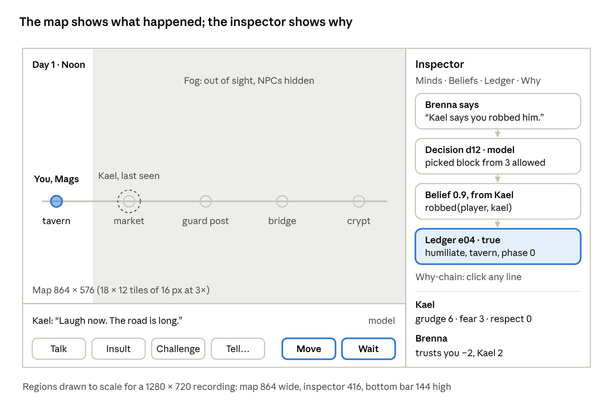
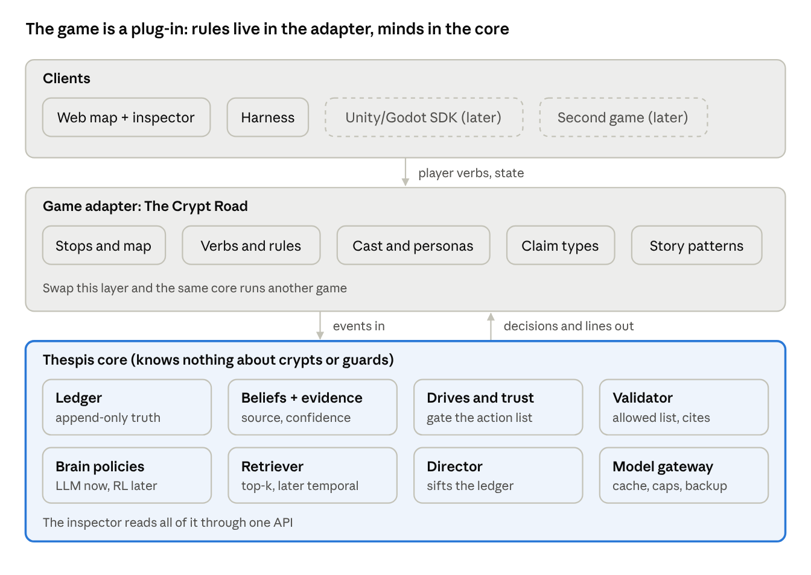
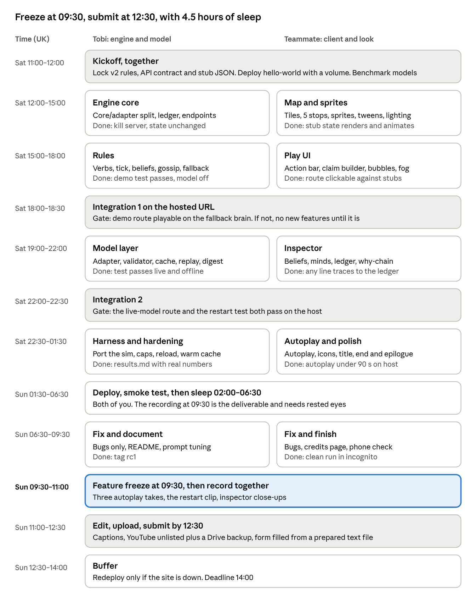

# The Crypt Road v2: Game Design

Oct 3, 2026 · @tobi

## Summary

Version 2 makes the race winnable four different ways and puts the novel part, NPCs acting on beliefs that can be false, into the core path rather than the optional beats. Every rule below was checked with a quick simulation of the tick.

**How to read this.** v2 replaces the v1 [Demo Game Spec](https://claude.ai/artifact/FrutUCipRn8JhVyLnjzS91) wherever they differ. The API contract section lists everything the client needs; anything not listed there keeps its v1 shape.

**Naming.** The framework is **Thespis**, and its modules take theatre names: **Cast** for NPC minds (built this weekend), **Director** for story sifting and pacing, **Stage** for game adapters and engine SDKs, and **Rehearsal** for the test harness and benchmark. In code, `core/` is the `thespis` package and The Crypt Road lives under `games/`.

What changed from v1:

- Brenna never leaves the guard post. Odo becomes a walking peddler (tavern, market, guard post, market), so gossip and testimony actually reach the guard.
- Kael's revenge goes through the guard: he tells Brenna what you did, and she blocks you. Ambush, flee and the bluff are cut.
- Winning a duel offers humiliate or spare straight away, in the same phase.
- Lies need trust. A stranger's claim lands at confidence 0.4, under the 0.5 action line, so you must bribe before a lie sticks.
- Kael leaves at the end of phase 0. Rushing ties, ties go to the player, and every detour must be paid back by delaying Kael.
- Fog of war: you see only your own stop. The narrator, our Dungeon Master, tells you what happened elsewhere.

Design goals:

- **Video:** in under 90 seconds show memory, an offscreen action, a belief passing between characters, a lie, and a restart.
- **Judge playthrough:** about 3 minutes, four distinct routes, each decided within 6 phases.
- **One system:** every route uses the same five parts (ledger, beliefs, drives, trust, validator), so the game demonstrates the framework rather than scripted content.

## World, map and time

The world is one straight road of five stops, read left to right, and everyone moves at most one stop per phase. Phases run morning, noon, evening, night: `day = phase // 4 + 1`, `phase_name = phase % 4`.

| Stop | Role in play | Who is there |
| --- | --- | --- |
| tavern (The Lantern & Last Coin) | Start. Duels, insults, gossip | Mags always. Player and Kael at start. Odo every morning |
| market | Odo's stall | Odo at noon and night |
| guard\_post | The gate. Bribes, accusations, arrests | Brenna always. Odo every evening |
| bridge | The only crossing to the crypt | Nobody |
| crypt | The relic. `take_relic` ends the game | Nobody |

Odo's walk is the only schedule: tavern (morning), market (noon), guard\_post (evening), market (night), then tavern again. Each step is one stop, so no one teleports. His walk is what carries news from the tavern to the guard.

**Turn.** The player takes any number of free actions, then ends the phase with `move`, `wait` or `challenge`. Duels resolve on the spot: after a win the player must pick `humiliate` or `spare`, and that pick ends the phase.

**Tick order** (end of every phase):

1. Player's phase action. A `move` from guard\_post to bridge is refused while Brenna's trust in the player is below 0.
2. NPC decisions on start-of-phase positions, Brenna first, then Kael. Model calls for different NPCs run in parallel.
3. Encounters: accusations and detentions apply, and the gate check runs for NPC moves.
4. Gossip between NPCs at the same stop, using the positions before moves.
5. Moves apply. Odo steps along his walk.
6. Drive upkeep: fear drops by 1 towards a floor of 1.
7. Phase goes up by 1. The client animates moves, then fetches the narrator digest separately.

**Race end.** The player wins by using `take_relic` as a free action on arriving at the crypt. Kael takes the relic at the end of the phase he is at the crypt. So arriving in the same phase is a player win.

**Fog of war.** The map draws only the player's current stop at full light. Other stops are dimmed, NPCs there are hidden, and the last place you saw each one shows a faded "last seen" marker. The narrator digest and the inspector are how you learn what happened out of sight.

## Cast

Four NPCs and a narrator, each with one job in the system: Kael remembers, Brenna enforces, Odo carries news, Mags witnesses, and the Dungeon Master tells you what you missed. Persona lines in quotes go word for word into the state pack.

| NPC | Starts at | Drives (0 to 10) | trust\_in (-5 to 5) | Goal | System job |
| --- | --- | --- | --- | --- | --- |
| Kael | tavern | grudge 0, fear 1, respect 1, ambition 6 | none | Take the relic | The persistent rival |
| Brenna | guard\_post, never moves | none | player 0, kael 2, odo 2, mags 1 | Keep the road orderly | Gate, arrests, belief from hearsay |
| Odo | tavern, then walks | none | player 0, kael 0 | Sell goods, avoid trouble | Gossip carrier and truthful witness |
| Mags | tavern, never moves | none | player 0, kael 0 | Keep the tavern calm | Witness and talker |

### Kael, the rival

"A sellsword with a reputation to protect: proud, quick to anger and slow to forgive. He speaks in short, cutting sentences and never forgets a slight."

| Action | Precondition | Effect | Fallback utility |
| --- | --- | --- | --- |
| `take_relic` | At crypt | Kael wins | 100 |
| `accuse(player)` | At guard\_post with Brenna, grudge 4 or more, believes he was robbed or beaten, not used yet | Brenna gets the claim at the confidence her trust in Kael gives (0.9). Kael stays this phase | grudge + 3 |
| `share_drink(player)` | Same stop as player, respect 4 or more, not used yet | Stays a phase and reveals one true belief as a tip | respect + 3 |
| `go_to(next)` | Gate allows him | Moves one stop east | ambition (6) |
| `wait` | Always | Nothing | 0 |

React lines fire when he is insulted, beaten, robbed, spared, shares a stop with the player, or witnesses a lie about himself (which also adds grudge +2).

Sample lines: "Laugh now. The road is long." (after humiliation). "Told the Captain what you did in the tavern. Enjoy the view." (meeting at the gate). "Liar! I never touched the peddler!" (witnessing the lie).

Fallback templates: `"You'll answer for {event}, {player}."`, `"Out of my way."`, `"A fair fight. I'll remember that."`

### Captain Brenna, the gate

"Captain of the bridge watch: dutiful, tired and practical. She believes people she trusts, and a fine paid in coin smooths most trouble."

| Action | Precondition | Effect | Fallback utility |
| --- | --- | --- | --- |
| `block(actor)` | Automatic at the gate when her trust in the actor is below 0 | Actor stays put, logs `blocked` | Code, no decision |
| `detain(npc)` | Same stop, she believes `robbed(npc, *)` at 0.5 or more, once per claim | NPC frozen for 2 phases | 10 |
| `question(npc)` | Odo or Mags at her stop, and she holds a crime belief naming them from another source | They testify. A claim they know to be false is retracted, her trust in its source drops 3, any detainee is released | 8 |
| `wait` | Always | Nothing | 1 |

She never detains the player. A player she distrusts is blocked and asked to pay a "fine" (`bribe`).

Sample lines: "Kael says you cut his purse in the tavern. You're not crossing." "Twenty coins says I was looking the other way." "Robbed the peddler, did he? Sergeant, hold him."

Fallback templates: `"No one crosses while I doubt them."`, `"{source} told me about {claim}."`

### Odo, the peddler

"A travelling peddler who walks this road every day: nervous, honest to a fault and eager to avoid trouble. Ask and he'll tell you what he saw."

He follows his walk (tavern, market, guard\_post, market) with no decisions. He witnesses what happens at his stop. When sharing a stop, he gossips his strongest belief the listener lacks, in this order: robbed, beat, insulted, at 0.8 times his confidence. When Brenna questions him, he states only what he witnessed or what was done to him, which is how a lie about him gets exposed.

Sample lines: "I saw nothing! Well. I saw the purse." "Robbed? Me? By Kael? Captain, I've never been robbed in my life."

### Mags, the innkeeper

"Innkeeper of the Lantern & Last Coin: warm, nosy, and misses nothing under her roof. She trades gossip like coin."

She never moves. She witnesses everything at the tavern, gossips to anyone there (Odo each morning), and on `talk` reveals her strongest belief about the player or Kael. In this short race she mostly gives the opening scene a voice and the player a hint.

Sample lines: "Kael won't forget that, love. That one keeps a list." "Odo saw the whole thing, and Odo talks."

### The Dungeon Master (narrator)

"A wry storyteller who recounts only what the ledger shows and ends every telling with a hook."

After each tick the narrator gets up to 12 ledger events as JSON and writes two or three sentences in the second person, mentioning only those events. It then adds one hook from the story-sifting patterns: revenge brewing (a humiliate, grudge 5 or more, no spare since), lie told (a false claim not yet exposed), or lie exposed (a retraction). After the race it writes an epilogue from two more simulated phases, so the world visibly carries on without you. This is your teammate's dungeon-master idea, kept as the voice of the game.

## Gameplay

The race is decided by what NPCs believe, not by speed. Rushing only ties, so any detour has to be paid back by changing what Brenna believes about you or about Kael. The player starts at the tavern with 10 coins.

### Player verbs

| Verb | Ends phase? | Precondition | Effect |
| --- | --- | --- | --- |
| `talk(npc, text)` | No | Same stop, 200 characters max | NPC replies in character. No state change. Mags reveals her strongest belief |
| `insult(npc)` | No | Same stop | Kael grudge +1. Witnesses believe `insulted(player, target)` |
| `challenge(kael)` | Yes | Same stop | Dice `hash(seed, event_id)`: win at 0.6. Win: Kael fear +2, grudge +2, `beat(player, kael)`, then choose below. Loss: Kael grudge +1, `beat(kael, player)` |
| `humiliate(kael)` | Yes (the duel's phase) | Just won a duel | Kael grudge +3, respect -1 (floor 0), player coins +30, `robbed(player, kael)` |
| `spare(kael)` | Yes (the duel's phase) | Just won a duel | Kael grudge -2 (floor 0), respect +3, `spared(player, kael)` |
| `tell_claim(npc, claim)` | No | Same stop, claim from the closed list | Listener's confidence comes from their trust in the player (table below). Ledger records the truth |
| `bribe(brenna)` | No | At guard\_post, 20 coins | Coins -20, Brenna's trust in the player +2 |
| `move` | Yes | Next stop east, gate rule applies | Player moves, tick runs |
| `wait` | Yes | None | Tick runs |
| `take_relic` | Ends game | At crypt | Player wins |

Claims (closed list): `robbed(a, b)`, `beat(a, b)`, `insulted(a, b)`, `spared(a, b)`, `lied(a, b)`. The v1 claims `is_going` and `has_relic` are dropped along with the bluff.

### Belief rules

- **Seeing:** every NPC at an event's stop, other than the actor and the target, believes it at 1.0. Actor and target always know it.
- **Being told:** the listener's trust in the speaker sets the confidence: trust 2 or more gives 0.9, trust 0 to 1 gives 0.4, trust below 0 gives 0.2. A belief under 0.5 is stored and shown but never triggers an action. Each report is stored as its own piece of evidence; for now the belief takes the highest confidence among them (see Built to grow).
- **Crime:** the first time Brenna believes `robbed(x, ·)` at 0.5 or more, her trust in x drops by 2.
- **Gossip:** Odo and Mags pass on one belief per listener per phase, at 0.8 times their confidence, worst news first (robbed, beat, insulted). Source becomes the gossiper.
- **Lies seen by their subject:** an NPC named in a false claim it witnesses gets grudge +2 and believes `lied(player, self)`.
- **Testimony:** a witness only states what it saw or what was done to it. A claim it knows to be false is retracted (`status: retracted`), and the listener's trust in the source drops by 3.

### Routes, as simulated

These outcomes come from a short Python model of exactly these rules, with the fallback brain making Kael's choices. Port it as the first test in the harness.

| Route | What the player does | Result | What it shows |
| --- | --- | --- | --- |
| Rush | Move every phase | Win at phase 4, on a tie | Baseline only |
| Provoke and pay | Insult, win duel, humiliate. Move twice. At the gate pay one fine. Move on | Win at phase 5, on a tie | Memory, a belief passed to the guard, a consequence, a way out paid with Kael's own coins |
| Provoke, don't pay | As above without the fine | Lose. Blocked at the gate from phase 3 | The consequence alone |
| **Frame Kael (demo route)** | Provoke and walk as above. At the gate pay two fines (all 40 coins), then tell Brenna `robbed(kael, odo)` | Win at phase 5. Kael is detained. In the epilogue Odo arrives at phase 6, the lie is exposed, Brenna's trust in you falls to -1 | A false belief acted on, then exposed by a witness |
| Lie without paying | Tell the lie at trust -2 | Lie lands at 0.2, ignored. Blocked, lose | Trust controls belief |
| Spare | Insult, win duel, spare. Move every phase | Win at phase 5, on a tie. Kael stays a phase to share a drink and gives a tip | Kindness also buys time |
| Duel lost | Insult, lose duel | Lose at phase 4 | Risk. The default seed wins the first duel |
| Provoke, then wait | Waste one phase after the duel | Lose, even with a fine or a lie. Kael is already past the gate | Time pressure |

Note that the rush route wins without touching anyone. That is fine for a 3-minute playthrough because on-screen hints and the autoplay steer judges towards the social routes. If you want rushing to lose, have Kael leave a phase earlier and rerun the model.

## Validator, fallback and model calls

The model is called for three jobs: speaking, choosing and narrating. Every call has a code fallback that keeps the demo route playing, and the simulation above was run on the fallback alone, so with grudge 6 Kael scores `accuse` 9 against `go_to` 6 and takes his revenge even with no model.

| Call | When | Returns | Fallback |
| --- | --- | --- | --- |
| `react` | A player verb targets the NPC; Kael shares a stop with the player at phase start; an NPC is blocked or witnesses a lie about itself | `{line, cites}` | Template line filled from the top cited belief |
| `decide` | Kael: a drive crosses a threshold (grudge 4 or 5, respect 4, fear 4), or he arrives at a stop with another NPC. Brenna: someone arrives at her stop, or she gains a crime belief | `{action, line, cites}` | Highest-utility allowed action plus template line |
| `digest` | After every tick, fetched by the client while it animates | `{text, hook}` | Code-built sentences from the ledger, one per event |

Everything else runs on default plans with no call: Kael walks east, Odo walks his route, Brenna and Mags stay put.

**State pack** (the only thing the model sees, about 900 tokens): the persona line, drives and trust, the five strongest active beliefs (by confidence, then recency) with their ids and sources, the last five events the NPC knows with ids, the goal, and the allowed actions with one-line descriptions. The `truth` field is never included.

**Prompt skeleton for `decide`:**

```
You are {name}. {persona}
You know only what is listed below. Never state a fact that is not listed.
Pick exactly one action id from ALLOWED. Write one line of dialogue, at most 25 words, in character.
In "cites", list the ids of the beliefs or events your line relies on.
Reply with JSON only: {"action": "...", "line": "...", "cites": ["..."]}
```

**Validator.** Reject and fall back when any of these fail: the action id is in the allowed list; every cited id is in the state pack; the line is 160 characters or fewer; the line names no character or stop absent from the pack. The decision record stores `source: llm | cache | fallback` and the reason.

**Settings.** JSON mode, `max_tokens` 150, temperature 0.6, thinking or reasoning off, 4-second timeout, no retries (go straight to the backup provider, then fallback). Decisions for different NPCs in one tick run in parallel.

**Cache and replay.** Key = sha256 of model, prompt version, call type and the canonical state pack. `REPLAY=1` serves only from cache and fallback. Warm the cache by playing the demo route twice on the hosted build with the default seed.

**Budget.** The demo route makes about 20 calls: 9 react lines, 3 decisions and 7 digests including the epilogue. Set the per-session cap at 60 and size the global cap from the credit balance once it is known.

## Visual and UX design

One screen sized for a 1280 × 720 recording: the map tells what happened, and the inspector's why-chain proves it came from the ledger. The why-chain is the most novel thing a judge will see, so it gets the most polish.



*Screen layout at 1280 × 720: map, bottom bar, inspector with the why-chain.*

Clicking any spoken line opens its chain: the line, the decision that produced it, the beliefs it cites, and the ledger event at the root, marked true or false.

**Map.** 18 × 12 tiles of 16 px drawn at 3× with `image-rendering: pixelated`, no camera or scrolling. The road runs left to right, with a vertical river under the bridge so it reads as the chokepoint. Stops sit at fixed tile x positions: tavern 2, market 5, guard post 9, bridge 12, crypt 15. Layers: ground and water, road, buildings and props, characters, bubbles and icons, fog, then the phase tint.

**Characters.** Kenney Tiny Dungeon and Tiny Town (CC0), one pack per look:

- player: a hooded rogue in green
- Kael: a red-cloaked fighter
- Brenna: an armoured guard in blue
- Mags: an aproned innkeeper
- Odo: a merchant with a pack

All have a name label in a pixel font. Walking is a straight tween between stops with a vertical bob and a shadow, plus a small squash on arrival.

**Signals of the mind.** Icons above heads come from drive numbers:

- angry mark at grudge 5 or more
- sweat drop at fear 4 or more
- star at respect 4 or more
- "!" burst when a belief arrives
- chains while detained
- "?!" when an NPC learns it was lied to

Gossip draws a thin line from speaker to listener for one second.

**Time and fog.** A clock reads "Day 1 · Noon". Each phase fades in a colour overlay over 0.8 seconds: soft warm morning, bright noon, orange evening, deep blue night with lit windows and the guard's torch. Fog dims every stop except the player's to about 30% light, hides NPCs there, and leaves a dashed "last seen" ghost.

**Bottom bar.**

- **Dialogue:** the latest line types out in the bubble above the speaker and is logged here with a small model, cache or fallback badge.
- **Buttons:** built from `/allowed`. Free actions are outlined; phase-ending ones (`Move`, `Wait`, `Challenge`) are accented with a clock icon. A disabled button shows its reason on hover, e.g. "Blocked: Brenna's trust in you is −2".
- **Tell…:** opens a three-dropdown claim builder: Kael, robbed, Odo.

**Inspector tabs.**

- **Minds:** drive bars and trust per NPC.
- **Beliefs:** per NPC, with a confidence bar, a source chip, and a tick, cross or question mark against the ledger.
- **Ledger:** event rows that slide in highlighted.
- **Why:** decision cards showing the allowed list, the pick, the cited ids and a source badge, plus the why-chain.

A narrator feed sits above the tabs and shows each digest as it arrives.

**Judge flow.** The landing screen offers two buttons: "Watch the 60-second story" (autoplay of the demo route with captions) and "Play it yourself". A first-time hint suggests "Try insulting Kael". Reset is always visible. Win and lose cards end with the narrator's epilogue and a "what the world remembers" summary of grudges and beliefs.

**Dev panel** (hidden, toggled with a key):

- reload from disk
- brain off, to force the fallback
- replay mode
- seed

Use it in the video for the restart and fallback shots; judges never need it.

**Look.** One palette: muted greens and browns for the world, warm orange for light, one accent colour for UI. Use a pixel font in the game and a clean sans-serif in the inspector, with rounded dark panels and no default browser buttons. Skip particles, parallax, animated water and weather unless everything else is done.

## API contract for the client

The engine owns all game logic; the client sends verbs, renders state and animates moves. The session id lives in the URL (`?s=`), so a reload resumes the run, and every request sends it as the `X-Session` header.

| Endpoint | Returns | Changed from v1 |
| --- | --- | --- |
| `POST /session` `{seed?}` | `{session, state}` | Default seed is the demo seed |
| `GET /state` | Full snapshot (shape below) | NPCs carry `last_seen`; beliefs carry an `evidence` list |
| `GET /allowed` | `{verbs: [{verb, target, args, ends_phase, enabled, reason}]}` | Disabled verbs are returned with a reason for the tooltip. After a duel win, only `humiliate` and `spare` are enabled |
| `POST /act` `{verb, target?, claim?, amount?}` | `{events, replies, tick, state}` | Replies carry `cites` and `source`. `tick` is `{moves, decisions, events}` with no digest |
| `GET /digest?since=<phase>` | `{text, hook, cites}` | Fetched while moves animate. After a win it also returns the epilogue |
| `POST /reset` | `{state}` | Unchanged |
| `POST /reload` | `{state}` | New: rebuilds this session from disk (dev panel) |
| `POST /dev/brain` `{mode: "model" \| "fallback"}` | `{mode}` | New: the "brain off" toggle for the video |
| `GET /health` | `{ok: true}` | Unchanged |

**Shapes.** Claims are `{pred, a, b}`. A trimmed `state` and one decision record:

```json
{
  "phase": 3, "day": 1, "phase_name": "night", "status": "playing", "brain": "model",
  "player": { "loc": "guard_post", "coins": 40 },
  "npcs": [
    { "id": "kael", "loc": "guard_post", "last_seen": { "loc": "tavern", "phase": 0 },
      "drives": { "grudge": 6, "fear": 2, "respect": 0, "ambition": 6 },
      "trust_in": {}, "frozen_until": null }
  ],
  "beliefs": [
    { "id": "b0012", "npc": "brenna", "claim": { "pred": "robbed", "a": "player", "b": "kael" },
      "conf": 0.9, "status": "active", "truth": true,
      "evidence": [ { "source": "kael", "event": "e0009", "phase": 2, "conf": 0.9 } ] }
  ],
  "ledger_tail": [], "decisions_tail": []
}
```

```json
{
  "id": "d0012", "npc": "brenna", "phase": 3, "trigger": "arrival",
  "allowed": ["wait"], "chosen": "wait",
  "line": "Kael says you cut his purse in the tavern. You're not crossing.",
  "cites": ["b0012", "e0004"], "reason": "trust in player -2", "source": "llm"
}
```

**Fog is the client's job.** `state` always contains every NPC's true position, because the inspector shows everything. The map hides NPCs away from the player's stop and draws `last_seen` ghosts instead.

**Stubs.** At kickoff, commit one fixture per demo beat (`state`, `allowed` and `act` responses), generated from the simulation model so the numbers match the acceptance test. The client builds against these until Integration 1. Whoever changes a shape updates the fixtures in the same commit.

## Demo script and acceptance test

The demo is the "frame Kael" route on the default seed, played by the autoplay button and recorded in 88 seconds. Each row is a video shot and a test: `demo_test.py` asserts the middle column after every step, first with the model off, then on, then with `REPLAY=1`.

| Video | Player does | Must be true | On screen |
| --- | --- | --- | --- |
| 0:00–0:06 | Nothing | Fresh session, seed set | Title over the map at dawn |
| 0:06–0:20 | Phase 0, tavern: insult Kael, challenge (win), humiliate | Kael grudge 6, fear 3 (2 once the tick runs), respect 0. Coins 40. Mags and Odo hold `robbed(player, kael)` at 1.0, marked true | Duel dice, Kael's three lines, grudge bar filling, ledger rows sliding in |
| 0:20–0:32 | Phase 1: talk to Mags, then move | Kael's tick-0 decision is `go_to`, model-made. Kael and Odo hidden by fog | Kael walks out of the light. Mags: "Odo saw the whole thing, and Odo talks." |
| 0:32–0:44 | Phase 2, market: move | Kael's tick-2 decision is `accuse`, citing the humiliate event. Brenna holds the robbery at 0.9 from Kael. Her trust in you is -2. Odo also gossips to her | Night falls. Narrator digest: what Kael and Odo did out of sight |
| 0:44–0:52 | Kill and restart the server, reload | Same phase, positions, beliefs, grudge and decision log. Nothing reseeded | Terminal and browser side by side, inspector unchanged |
| 0:52–1:04 | Phase 3, guard post | Kael is still there (accusing cost him the phase). His line cites the tavern. Move shows as blocked, trust -2 | Kael: "Told the Captain what you did in the tavern." Why-chain from Brenna's line down to the ledger |
| 1:04–1:16 | Bribe twice, tell Brenna `robbed(kael, odo)`, move | Belief stored at 0.9 and marked false. Brenna's trust in Kael drops to 0. Kael grudge 8, believes `lied(player, kael)`. Tick 3: Brenna detains Kael. Player reaches the bridge | Red cross on the lie. Kael: "Liar!" Chains icon on Kael |
| 1:16–1:24 | Phase 4 move, phase 5 `take_relic` | Status won. Epilogue ticks: at phase 6 Odo testifies, the lie is retracted, Brenna's trust in you is -1 | Victory card, then the epilogue: "Captain Brenna won't forget whose word she trusted." |
| 1:24–1:28 | Nothing | None | End card: architecture strip, harness numbers, link |

On every run: every NPC line cites at least one id from its state pack; no decision falls outside its allowed list; with the model up, no beat uses the fallback; with `REPLAY=1` the same route plays from cache with no network; and the autoplay finishes in under 90 seconds.

## Prior art and claims

NPCs whose beliefs can be false against ground truth have existed in symbolic systems since 2015, so that is not our novelty. What is new is putting that model under an LLM that may only choose code-validated actions and must cite ledger events in what it says.

| Prior art | Year | What it already does | What it lacks vs us |
| --- | --- | --- | --- |
| [Talk of the Town](https://www.gameaipro.com/GameAIPro3/GameAIPro3_Chapter37_Simulating_Character_Knowledge_Phenomena_in_Talk_of_the_Town.pdf) (Ryan et al.) | 2015 | Per-character beliefs that can be false, with source and decaying strength; lies, misremembering, revision | No LLM, no validated action set, not a reusable framework |
| [Viv](https://viv.sifty.studio/introduction/) (Ryan, Sifty) | Open beta | Domain-agnostic engine: time-ordered chronicle, witnessed memories, gossip, multi-phase plans, story sifting | No LLM; no confidence, false beliefs or retraction found |
| [Versu](https://versu.com/wp-content/uploads/2014/05/versu.pdf) (Evans & Short) | 2013 | Individual and false beliefs, actions from social practices, a drama manager | No LLM, no ledger, no confidence-weighted gossip |
| [Shadows of Doubt](https://colepowered.com/shadows-of-doubt-devblog-8-simulating-a-city/) | 2023, shipped | Witness memory that blurs over time, NPCs who lie, offscreen routines | One game, no LLM or narrator |
| [Generative Agents](https://arxiv.org/abs/2304.03442) (Park et al.) | 2023 | LLM memory stream, reflection, planning, information spreading | No ground truth or confidence; the model drives agents with no validated action set |
| [Orchestrated Reality](https://arxiv.org/html/2606.16014v1) | 2026 | Append-only event journal, plan-diff-validate-apply, deny-first permissions | No per-NPC beliefs or gossip; multi-NPC deferred |
| [AI Town](https://github.com/a16z-infra/ai-town) (a16z) | 2023 | Engine validators on agent inputs, stored agent memories | No belief model, no narrator |

**Developer toolkits (added 3 Oct).** [Ensoul](https://ensoul-ai.com/) is the closest competitor: memory and personality for thousands of NPCs, sold through Unity, Unreal and Godot SDKs, with no documented action validation or truth-versus-belief split. [Artificial Agency](https://artificial.agency/) and [Eposyne Director](https://eposyne.com/) already bound or rule-check model decisions, so validated actions alone are not a differentiator. What none of them documents: a ledger kept apart from sourced, retractable beliefs, and dialogue that cites events. Full comparison in [Redefining the NPC](https://claude.ai/artifact/7aZ11gEiU8ZrJMQwuuwpjW).

**Novelty wording for the submission:**

> We bring the symbolic character-knowledge tradition (Talk of the Town, Versu, Viv) to LLM-driven NPCs. An append-only ledger is ground truth, each NPC holds beliefs that may be false and can be retracted, and the model may only choose code-validated actions and must cite ledger events in what it says. That makes NPC lies and errors checkable rather than hallucinated.

**Claim:**

- The model has no write path to memory: only the game writes the ledger and beliefs.
- Every line cites ids that the validator checked against the state pack.
- NPCs can be wrong, act on it, and be corrected by testimony.
- Our own measured numbers: share of ticks with no model call, invalid actions blocked, cost per run, p50/p95 latency.

**Don't claim:**

- first, best, or parity with Nemesis
- per-NPC belief against ground truth as new
- refusal and negotiation (Tencent's agent already shows order refusal)
- better token efficiency than Affordable Generative Agents (different world and workload)
- "never hallucinates"

**Cite in the submission:** Talk of the Town, Viv, Versu and Generative Agents. Add Orchestrated Reality if there is room.

## Built to grow

The hackathon cuts limit scope, not architecture: everything deferred has a slot to plug into. As first written, though, v2 underbuilt the framework in three places. The fixes below cost about 90 minutes this weekend.



*Framework layers: clients, game adapter, game-agnostic Thespis core.*

The Crypt Road is one adapter on a core that never names a stop, a guard or a relic. A second game proves the framework by replacing only the middle layer.

### Three fixes to make this weekend

1. **Rules out of the core.** v1 and v2 put the Crypt Road rules inside the engine service, which would make this a game rather than a framework. Build two packages: `core/` (ledger, beliefs, drives, validator, brains, director, model gateway) and `games/crypt_road/` (stops, verbs, rules, the cast YAML, claim types, story patterns). The core takes events and returns decisions and lines; the demo's `/act` endpoint lives in the adapter. Test: nothing in `core/` imports from `games/`. About 45 minutes, inside the Engine core block.
2. **Store evidence, not one belief.** v2's "keep the higher confidence" throws away provenance when two sources agree, for example Brenna hearing from both Kael and Odo. Store each piece of evidence (claim, source, event, phase, confidence) and derive the belief from it, so a retraction removes one source's evidence and leaves the rest. Combine by maximum for the demo, so the simulated numbers still hold; switch to noisy-OR later. Add a decay rate per claim type, set to 0 for now. This is Talk of the Town's model, and the why-chain needs it anyway. About 30 minutes.
3. **Interfaces where the future plugs in:** `Brain` (LLM and utility now, learned later), `Retriever` (top five now), `ModelGateway` (providers), a registry for director patterns, and a `schema_version` on every event. They add no behaviour, just the seams. About 15 minutes.

### Deferred, and where it plugs back in

Rows are in a suggested order for after the hackathon.

| Deferred feature | Why not this weekend | Where it plugs in |
| --- | --- | --- |
| Godot SDK, then Unity, plus a small second game | The real proof the core is game-agnostic; too big for 27 hours | Adapter API |
| Evaluation suite as a published benchmark (contradiction rate, belief correctness, cost per hour, latency) | The harness comes first | Harness |
| Negotiation and refusal: counter-offers, bounded prices, accepted or refused requests | No mechanic in the demo, and it would need rebalancing | New action types in the adapter; `Brain` decides |
| Relevance and temporal retrieval (validity times, as in Zep) | About 20 events per run | `Retriever` |
| Reflections: model-written summaries | Risk of memory poisoning | A separate store marked non-authoritative, never cited as truth |
| Learned tactics: a bandit, then RL | Needs real play data | `Brain` policy |
| Ambush, bluff and other verbs | Balance time | Adapter |
| Authoring tool: the inspector becomes an editor for cast and rules | Polish after the core settles | Inspector API |
| Production: Postgres, auth, per-tenant keys, rate limits, prompt-injection filtering | SQLite is enough for a demo | Core storage and gateway |
| Legal advice on the Nemesis patent | Only matters comm<br/>ercially | Before charging anyone |

## Stretch goals

If the 22:00 Integration 2 gate passes on time, build the manor mystery first, then bounded negotiation if you are still ahead. Realistically one or two of these fit.

| # | Stretch goal | Owner, hours | Score payoff | Done when |
| --- | --- | --- | --- | --- |
| 1 | A second game on the same core: the manor mystery below, text-only in the inspector | Tobi 2.5h, teammate 0.5h | Track fit and Innovation: the only real proof the core works for any game | The harness solves it by script, and nothing in `core/` changed except NPC deception |
| 2 | Bounded negotiation on Brenna's fine | Tobi 1.5h, teammate 0.5h | Turns improvement 4 from roadmap into a working mechanic | The demo route still wins at phase 5 in the simulation; an offer of 10 gets a counter or a refusal |
| 3 | Model-judged numbers: a judge model checks about 50 lines against their state packs for contradictions and staying in character | Tobi 1h | Credibility with AI-lab judges | Two rates in `results.md`, labelled as model-judged |
| 4 | "SDK in 20 lines": an example client that sends events and asks for decisions | Tobi 0.5h | Shows the core's interface without a real SDK | Example runs against the hosted core |
| 5 | Live persona editing: change a persona line in the inspector, reload, hear the next line change | Teammate 1.5h | A dev-tool moment for the Game Tech track | Works on a fresh session without breaking the cache for the demo seed |

**Rules.**

- Start only after the 22:00 gate passes.
- Build each goal behind a feature flag, off by default.
- If one isn't working by 08:30 Sunday, switch it off and freeze at 09:30 as planned. Never trade the core demo for a stretch goal.
- If #1 lands, add a 5-second "same core, different game" shot by trimming the end card, so the video stays under 90 seconds.

### Design: the manor mystery (stretch 1)

A three-room detective scene that reuses the ledger, beliefs with evidence, trust-scaled claims, testimony, retraction, the validator and the narrator. Only the adapter is new, plus one core feature: NPC deception as a validated action, logged with `truth: false`. That is the "log deception as a deliberate act" rule from the prior-art guide.

- **Rooms:** hall, study, kitchen.
- **Cast:**
  - Lady Vane, the owner, never moves. Her beliefs decide the case. trust\_in: Pell 3, Sable 2, player 0.
  - Pell, the butler, always tells the truth.
  - Sable, the maid, took the signet ring and may lie to protect herself.
- **Ground truth, written before the player arrives:** phase 0, Sable takes the ring in the study with no witness. Phase 1, Pell sees Sable leave the study. The player arrives at phase 2, so the crime happened offscreen and lives only in the ledger.
- **Claim types, defined in the adapter:** `took(a, item)`, `was_in(a, room, phase)`. The core never sees these names, which is the point.
- **Player verbs:**
  - `move(room)` ends the phase.
  - `ask(npc, topic)` is free.
  - `request_questioning(npc)` asks Lady Vane to question someone in her presence.
  - `accuse(npc)` ends the game.
- **Sable's brain:** when asked about the morning with fear 3 or more, her allowed list includes `deceive(was_in(sable, kitchen, 1))`. Being asked raises fear by 2. The model picks deceive or deflect, and the line must cite the claim it asserts.
- **Solve path:**
  1. Ask Sable. She lies, and the inspector shows a red cross.
  2. Ask Pell, who saw her leave the study.
  3. Request that Lady Vane question Pell. His testimony contradicts Sable's claim, so Lady Vane retracts it and her trust in Sable drops by 3.
  4. Accuse Sable.
- **Win:** at the accusation, Lady Vane believes `was_in(sable, study, 1)` at 0.5 or more and has retracted Sable's alibi. Accusing anyone else, or accusing too early, loses.
- **Optional offscreen beat:** when Sable's fear reaches 5, she spends a phase hiding the ring in the kitchen, and the narrator reports "footsteps in the kitchen".

### Design: bounded negotiation (stretch 2)

`bribe(amount)` replaces the fixed fine. Code sets the bounds and the model picks within them, so the economy can't be talked out of shape.

- **Player offers** 5 to 40 coins.
- **Brenna's allowed list:** `accept`, `counter(price)` with a price between 15 and 30, or `refuse`. At trust below 0 she never accepts under 20.
- **Fallback:** accept at 20 or more; otherwise counter at 20.
- **Effect:** an accepted fine of 20 or more gives trust +2, the same as v2.
- **Check:** the demo route offers 20 twice and is accepted both times, so the simulated results still hold. Re-run the model to confirm.

## Kickoff and submission

The first hour fixes the stack, the model and the call caps, and the submission goes in by 12:30 Sunday using the text drafted here. The rules model `crypt_road_sim.py` reproduces every route outcome in this doc and passes the full demo-route acceptance test; use it for fixtures and as the harness's first test.

### First hour, together (11:00–12:00)

- [ ] Agree the v2 rules and the API contract; commit fixtures generated from `crypt_road_sim.py`.
- [ ] Stack: FastAPI and sqlite3, serving the client as static files from one URL. Canvas or Phaser for the client is your teammate's call.
- [ ] Host with a persistent volume (Fly.io or Railway, EU region). Deploy a hello-world and run the restart test on the host.
- [ ] Claim credits, benchmark models (below), and set `LLM_BASE_URL`, `LLM_API_KEY` and `LLM_MODEL` plus a backup.
- [ ] Demo seed: 1 in the simulation (seed 7 loses the first duel). Re-check once the engine's event ids exist.
- [ ] Download the Kenney packs; one repo, everyone commits to main in small commits.

### Choosing the model

- Benchmark from the host, not a laptop: 20 calls per candidate with a real state pack, JSON mode, `max_tokens` 150, thinking off.
- Candidates: the fast non-reasoning tier of the three providers whose credits actually arrive (likely DeepSeek, Qwen international, GLM; Tencent HY if available).
- Primary: the lowest p95 among those with at least 95% valid picks and p95 under 3 seconds. Backup: the next best from a different company, switched to on error or timeout.
- No credits by 12:00: use a cheap paid key (about £10) rather than wait.
- If Tencent HY passes, use it for the narrator, which is async and a sponsor's model.

### Call caps

1. Measure calls per demo run; about 20 are expected.
2. Per-session cap: 3× that, about 60.
3. Global cap: 0.5 × credit balance ÷ cost per call, where cost per call ≈ 1.2k input tokens × input price + 150 output tokens × output price.
4. At most 4 calls at once, and 5 new sessions per IP per hour.
5. On a cap hit, a 401, 402 or 429 error, or a timeout: switch to fallback and show the "offline brain" badge. Cache hits don't count.

### Questions for the organisers

| Question | Default if no answer |
| --- | --- |
| Was any code allowed before 11:00? | No; design docs only |
| Do credit keys keep working during judging? | Assume not; fallback and replay must look good |
| How long must the link stay live? | Two weeks |
| Video length limit and host? | Under 90 seconds, YouTube unlisted, Drive backup |
| Is the project link the playable site or the repo? | Playable site, with the repo linked from it |
| Can a submission be edited after sending? | No; submit once |
| Are third-party and AI-generated assets allowed? | CC0 with a credits file |

### Top risks

| Risk | Mitigation |
| --- | --- |
| The hosted link fails during judging: wiped disk, cold start, dead credits, exhausted cap | Persistent volume, always-on machine, automatic fallback, cache pre-warmed on the demo seed, per-IP limits, smoke tests at 07:00 and 12:45 |
| Model latency or bad output | Small non-reasoning models, JSON mode, 4 s timeout, parallel calls, backup provider, template lines, async digest |
| The two halves drift apart | Contract and fixtures at kickoff, integration on the hosted URL at 18:00 and 22:00, `demo_test.py` as the definition of done |
| Scope overrun | Stretch goals behind switches, the 18:00 fallback-playable gate, freeze at 09:30 |
| Submission failure | Video uploaded by 12:00 and checked logged-out, form filled from this section, confirmation screenshot, git tag `submitted`, no deploys after 12:00 unless the site is down |

### Submission text

**Name:** Thespis, an AI/ML toolkit for game developers. This submission is its first module, Thespis Cast (NPC minds), demonstrated in The Crypt Road. Use `thespis-sdk` on PyPI and `@thespis/core` on npm, since the plain names are taken, and check domains and trademarks before any launch. Tagline: "NPCs that remember, believe, and act when you're not looking."

**Short description:**

> Thespis Cast is the first module of Thespis, an AI toolkit for game developers: a game-agnostic NPC layer where the game, not the model, owns the truth. Every event goes into an append-only ledger. Each NPC builds beliefs from evidence, with source and confidence, and they can be wrong; numeric drives and trust decide what it will do, and it keeps pursuing its goals offscreen on cheap rules. The LLM only picks from code-validated actions and voices them, citing the ledger events behind each line. It brings the symbolic character-knowledge tradition (Talk of the Town, Versu, Viv) to LLM-driven NPCs. In The Crypt Road, humiliate your rival and he reports you to the guard out of sight; frame him with a lie and a passing witness exposes you later; restart the server and nobody forgets.

**Video:** follow the Demo script section shot for shot.

**Credits:** the Kenney packs (CC0), the model providers used, and any generated images. Leave Nemesis out of the submission entirely.

## Revised schedule

Working the whole event gives you about 15 build hours each instead of 9, enough to bring back the gossip, testimony and lie routes. Don't skip sleep, though: the 09:30 recording is what judges see, and code written at 04:00 is the code most likely to break it.



*Build plan: two lanes, two integration gates, one freeze.*

The two halves only meet at the two integration gates and the freeze. Take lunch inside the first block and dinner 18:30 to 19:00.

**Ownership.** Your teammate owns the whole client, including the inspector, the autoplay and the video edit. You own the engine, the model layer, the harness, deployment and prompts. Personas, sample lines and fallback templates live in one data file you both edit during kickoff.

**Back from the cut list** with the extra hours: Odo's walk, gossip and testimony; spare and the shared drink; the lie and detain route; the epilogue; the harness; the autoplay; full polish (lighting, emotion icons, typed bubbles, dice and chain animations); Kling portraits for the dialogue box if credits arrive, generated once as static files.

**Still cut:** 3D and Tripo, ambush, the bluff, the bandit, classifiers, and any second game or Discord bot.
