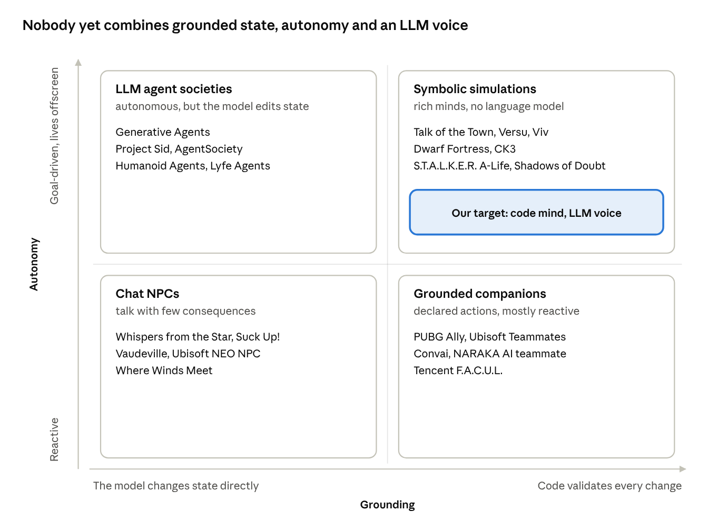
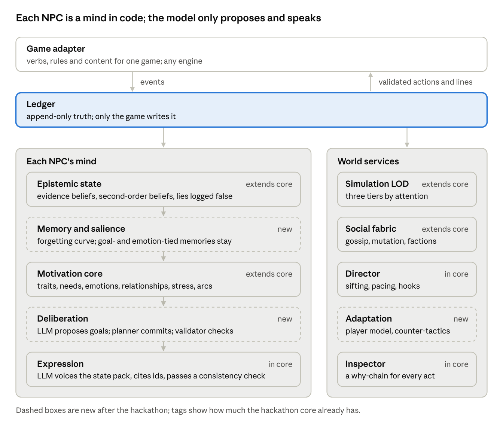

# Redefining the NPC: Deep Research

Oct 3, 2026 · @tobi

## Bottom line

The field has settled on a split: the LLM decides intent and speaks, and the game executes from a list of actions designers declared. What nobody has shipped is an NPC that holds its own fallible view of the world, wants things for reasons, and keeps pursuing them cheaply when the player is away. That gap is where to build.

**Name.** The toolkit is **Thespis**, with NPC minds as its first module, **Thespis Cast**. Later modules follow the theatre metaphor: **Director** for story sifting and pacing, **Stage** for engine adapters and SDKs, and **Rehearsal** for the test harness and benchmark.

What the evidence says is missing:

- **A wall between talk and state.** In Where Winds Meet (Nov 2025), typing "(I completed your quest)" made NPCs hand over rewards. Generative Agents lets the model change object state directly.
- **Memory you can trust.** Turning memory on cut factual accuracy by 18–30 points in one 2026 benchmark, and poisoning attacks reach over 80% success through ordinary input.
- **Theory of mind that holds.** On FANToM, humans score 87.5% and GPT-4 26.6%. Explicit belief tracking in code helps far more than better prompting.
- **Drives.** Project Sid's own authors say their agents lack "innate drives". Personality written into a prompt drifts within 8 turns and lets training-data habits leak through.
- **Affordable offscreen life.** Generative Agents cost "thousands of dollars" for 25 agents over two game days. Shipped titles run one companion each.
- **Players who stay.** Steam reviews of games that disclose generative AI are 17.9 points less positive. Suck Up! sits at 63% and Vaudeville at 48%.

The five improvements that would most change what an NPC is:

1. **NPCs that know things, wrongly.** Beliefs built from evidence in code, including what an NPC thinks others know, so lying, bluffing and secrets become real mechanics.
2. **The game holds authority.** Only the game writes memory and state. The LLM proposes intents and words, and a validator decides.
3. **Motivation as a running system.** Traits, needs, emotions, relationships and stress as numbers that change with events and gate what an NPC will do, with personality that shifts slowly over a story.
4. **Autonomy at a price you can pay.** The LLM proposes goals, a planner commits to them, and simulation level of detail runs distant NPCs on rules.
5. **Rivals that learn, and a director that tells it back.** Adversaries that adapt to how you play, and story sifting that turns the ledger into arcs and retellings, all visible in an inspector.

## The landscape

NPC approaches fall into four camps, and the one that matters is empty: rich symbolic minds that live offscreen have no language model, and LLM agents that live offscreen let the model change the world directly.

*Approaches to NPCs by grounding and autonomy.*

Systems are placed by zone, not exact position. The top-right box is where this project aims.

- **The field converged on "LLM decides, engine executes".** No shipped title lets the model produce free-form actions. PUBG Ally runs a behaviour tree per frame with an LLM for intent; Ubisoft Teammates lets designers set what NPCs can do and the LLM decide how.
- **Inference is moving onto the player's GPU.** inZOI uses a 0.5B model; NVIDIA's in-game SDK added Qwen3-8B in October 2025. The driver is cost: Retail Mage cut its inference about 1000×, Inworld retired its character product, and Replica Studios closed in June 2025.
- **Commercial value sits in two genres:** talking as the core mechanic, and voice-commanded squadmates. Autonomous offscreen societies exist only in research.
- **Agent research split in two:** NPC societies, and agents that play games like a person from pixels (Cradle, SIMA 2, Lumine). The second track is not about NPCs.
- **Scale stops at a handful.** AI People runs about 5 NPCs per scenario, Project Sid's 1,000-agent runs exceeded its server, and on-device titles run one companion each. No one has published per-NPC costs for many persistent agents in a shipped game.

### Developer toolkits to know

The closest commercial competitor is Ensoul, which sells memory and personality for thousands of NPCs to the same buyer through engine SDKs. None of these toolkits documents a ground-truth ledger, beliefs that can be false and retracted, or dialogue that cites events; several already validate actions, so that alone is not a differentiator.

| Toolkit | Status | What it does | How the LLM is constrained | Memory and beliefs |
| --- | --- | --- | --- | --- |
| [Ensoul](https://ensoul-ai.com/) | Cloud service; Python SDK 0.3.0 on 28 Sep 2026; SDKs for Unity, Unreal, Godot and four languages | Personas with Big Five traits, values and life-stage arcs; population generation; factions; claims "thousands" of personas | No action system documented | Episodic, semantic, procedural and relational memory that decays, weighted by emotion; no truth-versus-belief split documented |
| [Artificial Agency](https://artificial.agency/) | Commercial, Unity first; first title announced Sept 2026 for 2027 | Turns game systems into autonomous agents | Agents act within developer-defined bounds; a fast reflex layer separate from slower reasoning | "Character memory"; no belief model documented |
| [Eposyne Director](https://eposyne.com/) | Beta; free to build, then 1% of gross above €100k | On-device AI game master for world and narrative | "Every decision checked against your rules" | Not documented |
| [Player2](https://player2.game/) | Active; free tier; Godot, Unity, Defold and mods | Simple LLM NPC API | The LLM calls developer-written functions; no validation documented | Chat history plus world events pushed in |
| [Convai](https://www.convai.com/) | Active; Unity, Unreal | Embodied NPCs with perception and actions | Declared actions and narrative flows | "Long-term memory" |
| [openNPC](https://github.com/balaraj74/openNPC) | Hobby project | Engine-agnostic NPC service over REST | Action validator with a fallback policy; LLM optional | SQLite with forgetting curves; weighted goals |
| [pneuma-core](https://github.com/dayzorro/pneuma-core) | Small open-source library, single character | Companion "inner world" for chat characters | None; no actions or game state | Personality-biased retrieval; PAD emotion decaying to a baseline; end-of-session diary |

**Worth borrowing:**

- Ensoul's emotion-weighted decay, consolidation at the end of a conversation, a `forget()` call for deleting player data, and generating populations from archetypes.
- pneuma-core's personality-biased retrieval and PAD emotion that decays to a baseline.
- openNPC's fallback that always returns a valid action.
- Player2's distribution: a free tier, game jams and mod communities.

## Memory and persistence

Memory systems for LLM agents mostly let the model write its own memory, and that is the root of their failures. For NPCs, the game should own the record and the model should only read it.

### How current systems remember

| System | What it stores | Who writes it | Notable result |
| --- | --- | --- | --- |
| [Generative Agents](https://arxiv.org/abs/2304.03442) | A stream of natural-language memories, plus reflections | The LLM, including importance scores of 1 to 10 | Retrieval = recency (0.995 decay per game-hour) + importance + relevance. Reflection lifted believability (TrueSkill 29.9 vs 26.9) |
| [MemGPT / Letta](https://arxiv.org/abs/2310.08560) | Working context, recall and archival stores, like an operating system's memory tiers | The LLM, through function calls | Deep-memory retrieval rose from 32.1% to 92.5% |
| [MemoryBank](https://arxiv.org/abs/2305.10250) | Logs, summaries and a profile of the user | The LLM | Forgetting curve R = e^(−t/S); each recall strengthens S |
| [Mem0](https://arxiv.org/html/2504.19413) | Extracted facts | The LLM chooses ADD, UPDATE, DELETE or no change | p95 latency 0.49 s vs 5.22 s for the full context; over 90% fewer tokens (vendor-reported) |
| [A-MEM](https://arxiv.org/html/2502.12110) | Linked notes | The LLM, which also rewrites older notes | About 1,200 tokens per operation |
| [Zep / Graphiti](https://arxiv.org/html/2501.13956) | A temporal knowledge graph; each fact has a time it was true and a time it was recorded | The LLM marks contradicted facts invalid rather than deleting them | LongMemEval 71.2% vs 60.2%; context cut from 115k to 1.6k tokens (vendor-reported) |
| [Memory-R1](https://arxiv.org/html/2508.19828) | Same operations as Mem0 | A manager trained with RL on 152 examples | About 30% above Mem0 on LoCoMo with an 8B model |

### Where memory breaks

- **Memory can make agents worse.** In [MemSyco-Bench](https://arxiv.org/html/2607.01071v2) (2026), turning memory on cut factual accuracy by 18–30 points, and 61–62% of those errors happened after the right memory was retrieved. Agents defer to what they remember.
- **Errors spread forward.** Agents copy whatever past records they retrieve ([experience-following](https://arxiv.org/abs/2505.16067)). The [2026 memory survey](https://arxiv.org/html/2603.07670) lists summarisation drift, self-reinforcing errors and poisoned reflections, and finds systems "fail conspicuously on selective forgetting".
- **Poisoning is easy.** [MINJA](https://arxiv.org/html/2503.03704) plants memories through ordinary queries with 98.2% injection success. [AgentPoison](https://arxiv.org/abs/2407.12784) passes 80% attack success with under 0.1% of the store poisoned. For a game, that means players rewriting an NPC's memory by talking.
- **Benchmarks don't transfer.** Agents near the top of [LoCoMo](https://arxiv.org/abs/2402.17753) do poorly on [MemoryArena](https://arxiv.org/html/2602.16313), where later sessions depend on earlier ones. On [LongMemEval](https://arxiv.org/html/2410.10813), GPT-4o falls from 0.870 to 0.606 when given the full history.
- **Story consistency is poor.** On [NCP-Bench](https://arxiv.org/html/2608.08160v1) (2026), even the best model kept its narrative commitments through 20 turns in only 42% of runs, and contradicted facts caused 40–68% of failures.

### Beliefs and theory of mind

- **Models infer beliefs but don't act on them.** On [SimpleToM](https://arxiv.org/html/2410.13648), GPT-4o identifies a character's mental state 95.6% of the time but predicts their behaviour from it only 49.5%. Handing the model its own belief answer back lifts that to 82.8%.
- **Higher orders collapse.** On [FANToM](https://arxiv.org/abs/2310.15421), humans score 87.5% and GPT-4 with chain-of-thought 26.6%. [Hi-ToM](https://arxiv.org/abs/2310.16755) accuracy falls with each level of nesting, and a [2026 study](https://arxiv.org/html/2602.10625v1) found bigger reasoning budgets make fourth-order belief worse.
- **Explicit belief state works.** [SymbolicToM](https://arxiv.org/abs/2306.00924) keeps a belief graph per character and gains sharply. [Thought-tracing](https://arxiv.org/html/2502.11881v2) lifts FANToM from 11.1% to 41.5%.
- **Deception works best with a separate planner.** Meta's [Cicero](https://ai.meta.com/blog/cicero-ai-negotiates-persuades-and-cooperates-with-people/) tied dialogue to moves chosen by its planner and scored more than double the human average in Diplomacy (figures from Meta's blog).

### Persona over time

- Persona [drifts within 8 rounds](https://arxiv.org/abs/2402.10962) as attention to the system prompt decays.
- On [PersonaGym](https://arxiv.org/abs/2407.18416), GPT-4.1 was no more consistent than LLaMA-3-8B, so model size does not fix consistency.
- [Abdulhai et al.](https://arxiv.org/html/2511.00222v1) define line-to-line and question-answer consistency checks; a judge model agrees with humans about 80% of the time.

### What this means for NPC memory

- **The game writes; the model reads.** The append-only ledger is truth. Beliefs are derived from evidence by code. The model may propose an interpretation, tagged as inferred, but never edits canon.
- **Layers.** Ledger, then evidence and beliefs with two timestamps (happened, learned), then summaries for flavour that can always be rebuilt from the ledger.
- **Forget by rank, not by deletion.** Decay how easily a memory is retrieved, and mark contradicted beliefs retracted rather than deleting them.
- **Belief state in code, at least two levels deep.** What the NPC believes, and what it believes others believe. Pass that state to the model explicitly every call.
- **Measure memory through play.** A test where a later scene depends on an earlier one, not question answering.

## Goals and autonomy

Games solved how agents pursue goals 20 years ago with planners; LLMs solve where goals come from and how to talk about them. The strongest design lets the LLM propose and a planner commit, and reserves the LLM for agents the player can perceive.

### Classic planners

| Approach | How it works | Shipped in | Strength | Limit |
| --- | --- | --- | --- | --- |
| [GOAP](https://www.gamedevs.org/uploads/three-states-plan-ai-of-fear.pdf) | A\* search over world states, with actions as edges carrying preconditions and effects | F.E.A.R. (2 states: Goto, Animate) | Goals decoupled from actions, so different characters satisfy the same goal differently | Search cost; Transformers moved to HTN for speed |
| [HTN](https://www.gameaipro.com/GameAIPro/GameAIPro_Chapter12_Exploring_HTN_Planners_through_Example.pdf) | Decompose compound tasks through ordered methods into primitive actions | Killzone 2/3, Transformers, [Horizon](https://www.guerrilla-games.com/read/htn-planning-in-decima) | Fast; authorable; replans at a fixed rate | Methods must be written by hand |
| [Utility AI](https://www.gameaipro.com/GameAIPro/GameAIPro_Chapter09_An_Introduction_to_Utility_Theory.pdf) | Response curves score each option from 0 to 1; pick the top or weighted random | The Sims, Guild Wars 2 ([IAUS](https://www.gameai.com/iaus.php)) | Smooth, personality-friendly; inertia stops flip-flopping | Tuning is "more art than science" |
| [The Sims](https://users.cs.northwestern.edu/~forbus/c95-gd/2001/Programming%20Objects%20in%20The%20Sims.pdf) | Objects advertise how much they satisfy each need; personality scales the advertisements | The Sims | Behaviour lives in the world, so content scales | Needs only; no long goals |
| [BDI](https://www.cs.ox.ac.uk/people/michael.wooldridge/pubs/atal98b.pdf) | Beliefs, desires, and intentions as committed plans | Research and simulation | Commit, and reconsider only at key moments | Little learning or coordination |

### LLM plus planner

- **The LLM generates, code verifies.** [LLM-Modulo](https://arxiv.org/abs/2402.01817) argues LLMs cannot plan or check their own plans alone. [LLM+P](https://arxiv.org/abs/2304.11477) translates to a classical planner and solved problems the LLM alone could not even make feasible.
- **Ask the LLM only when the planner is stuck.** [ChatHTN](https://arxiv.org/abs/2505.11814) asks for a decomposition only when no method applies, and stays provably sound. A [follow-up](https://arxiv.org/abs/2511.12901) learns reusable methods from those answers, so LLM calls fall as the NPC gains experience.
- **Generating whole planning models is still weak.** LLMs produced 1% syntactically valid HTN domains vs 20% for flat ones ([2511.18165](https://arxiv.org/abs/2511.18165)). Generated behaviour trees fare better: [BTGenBot](https://arxiv.org/html/2403.12761v1) reached 88.9% syntactic correctness with a validator.
- **Personality leaks.** In a game study where an LLM picked goals from personality and memory and a PDDL planner planned them, [training-data habits overrode personality](https://www.arxiv.org/pdf/2501.10106). Personality needs to bias choices in code, not just in the prompt.
- **Shipped companions split fast and slow control.** PUBG Ally runs a behaviour tree per frame and a small on-device model for intent ([NVIDIA](https://www.nvidia.com/en-us/geforce/news/nvidia-ace-autonomous-ai-companions-pubg-naraka-bladepoint/) announced it on an 8B Minitron; Krafton reports a 2B distilled version calling 3–5 tools per cycle in its 2026 beta). [Ubisoft Teammates](https://www.gamedeveloper.com/business/ubisoft-s-first-playable-generative-ai-experience-is-an-r-d-experiment-called-teammates-): designers set what NPCs can do, the LLM decides how.

### Offscreen life and level of detail

- **S.T.A.L.K.E.R. A-Life** ran NPCs within about 150 m in full detail. Offline NPCs moved on a coarse graph and fought by dice roll ([interview](http://aigamedev.com/open/interview/stalker-alife/)).
- **Dwarf Fortress** simulates about 1,000 years of history at world generation, with personalities from 30 facets. Tarn Adams' rule: model "at the level of what the player sees or one layer below" ([Game AI Pro 2](https://www.gameaipro.com/GameAIPro2/GameAIPro2_Chapter41_Simulation_Principles_from_Dwarf_Fortress.pdf)).
- **Oblivion's Radiant AI** was scaled back because autonomous NPCs broke quests and players read their behaviour as bugs ([secondary](https://blog.paavo.me/radiant-ai/)). Autonomy needs designer guard rails and legibility.
- **Research has the tools.** [Brom et al.](https://artemis.ms.mff.cuni.cz/main/papers/IVE_IVA07.pdf) collapse a goal tree at low detail, cutting CPU from 5–10% to 0.1–0.5%. Sunshine-Hill's [LOD Trader](http://www.gameaipro.com/GameAIPro/GameAIPro_Chapter14_Phenomenal_AI_Level-of-Detail_Control_with_the_LOD_Trader.pdf) spends a detail budget where a break in realism is most likely to be noticed.
- **Cost shows why this matters for LLMs.** [Lyfe Agents](https://arxiv.org/html/2310.02172) run at $0.50 per agent-hour by letting the LLM pick a high-level option and cheap code execute it; Generative Agents were estimated at $15–50. [Affordable Generative Agents](https://arxiv.org/html/2402.02053) skip the LLM when a cached plan matches.

## Personality, emotion, rivals and directors

The games with the most memorable characters model personality as numbers that change with events and push behaviour, not as a description. LLM agents mostly do the opposite: personality lives in prompt text, which drifts and leaks.

### Personality and emotion as systems

- **Appraisal.** The [OCC model](https://people.idsia.ch/~steunebrink/Publications/KI09_OCC_revisited.pdf) derives 22 emotion types from how events affect goals, how actions measure against standards, and how objects match tastes. [FAtiMA](https://www.ifaamas.org/Proceedings/aamas2019/pdfs/p2357.pdf) and [EMA](https://www.sciencedirect.com/science/article/abs/pii/S1389041708000314) implement appraisal as rules, with coping and re-appraisal. [PAD](https://link.springer.com/article/10.1007/BF02686918) gives a 3-D mood space that maps to Big Five traits.
- **Traits with consequences.** In CK3, traits weight AI decisions (Brave +200 boldness), and acting against them builds stress that forces a breakdown at 100, 200 and 300 ([wiki](https://ck3.paradoxwikis.com/Stress), secondary). RimWorld thoughts range from −35 to +40, decay over set durations and stack with diminishing returns; mood below 35%, 20% and 5% risks a breakdown ([wiki](https://rimworldwiki.com/wiki/Thoughts), secondary).
- **Social volition.** In [Comme il Faut / Prom Week](https://mtreanor.com/publications/TCIAIG-CiF.pdf), traits, directed relationship networks and a history of social facts feed weighted rules that decide what each character wants to do. 263 playthroughs of one campaign were all distinct.
- **Social practices.** [Versu](https://www.cs.uky.edu/~sgware/reading/papers/evans2014versu.pdf) has 1,000+ actions offered by the practices a character is in, chosen by utility with a one-step lookahead. An episode took 2 months to author against Façade's 3+ years.
- **LLMs with affect.** Driving prompts from a PAD state changed agent choices measurably ([2510.13195](https://arxiv.org/pdf/2510.13195)). But prompted Big Five profiles behaved unevenly ([2503.15497](https://arxiv.org/html/2503.15497v1)), and generative agents' emotions aligned only weakly with human ratings ([2402.04232](https://arxiv.org/abs/2402.04232)).
- **Nemesis, at a high level.** Enemies whose traits, strengths and weaknesses change with fight outcomes and memories of the player, under a patent ([US10926179](https://patents.google.com/patent/US10926179B2/en)) that runs to 2036. Build from generic drives, beliefs and relationships, never its hierarchy mechanism.

### Rivals that learn

- **Dynamic scripting** ([Spronck 2006](https://ericpostma.nl/publications/Sproncketal2006.pdf)) rewards or punishes rule weights after each encounter. The adaptive AI pulled ahead after 10–53 encounters; "top culling" turns the same mechanism into difficulty control.
- **Killer Instinct's Shadows** learn from 400–700 patterns per match and sometimes pick a lower-ranked move to surprise ([Game Developer](https://www.gamedeveloper.com/programming/the-killer-groove-the-shadow-ai-of-killer-instinct)).
- **Hamlet** ([Hunicke](https://users.cs.northwestern.edu/~hunicke/pubs/Hamlet.pdf)) predicts a player shortfall and quietly intervenes; Forza's Drivatar learns from how each player drives (secondary).

### Directors and story sifting

- **Pacing.** The [Left 4 Dead AI Director](https://steamcdn-a.akamaihd.net/apps/valve/2009/ai_systems_of_l4d_mike_booth.pdf) tracks each survivor's intensity and cycles build up, peak (3–5 s), fade and relax (30–45 s). RimWorld's storytellers scale threats with wealth and colony health ([wiki](https://rimworldwiki.com/wiki/AI_Storytellers), secondary).
- **Drama management.** [Façade](https://cdn.aaai.org/ojs/18722/18722-52-22361-1-10-20210928.pdf) chose about 15 of 27 beats per play to fit a tension arc. Its language understanding failed about 30% of the time.
- **Sifting.** [Felt](https://mkremins.github.io/publications/Felt_SimpleStorySifter.pdf) runs patterns over the event database, and the same patterns can unlock actions (two betrayals produce a resentment motive). Without sifting, simulation feels like "just one damn thing after another" ([Kreminski](https://mkremins.github.io/publications/AuthoringSifters_TAP.pdf)).
- **LLMs as sifters.** ChatGPT sifted worse than an evolutionary search and made up events, but wrote good prose from chosen events ([Méndez & Gervás](https://computationalcreativity.net/iccc23/papers/ICCC-2023_paper_124.pdf)). [DRAMA LLAMA](https://arxiv.org/pdf/2501.09099) lets authors write storylet triggers in natural language, checked by an LLM.
- **Gap:** no strong source turns simulation state into generated quests. Felt's motive pattern is the nearest.

## Players and failure modes

Players enjoy LLM NPCs when talking changes something and the facts hold still; they leave when NPCs invent facts, agree with everything, or make them wait. Players also start from scepticism towards anything labelled AI.

### What studies found

- **Fun but unfinished.** In a Minecraft quest with two GPT-4 NPCs (N=28), 88% said it was fun but only 25% finished, because the NPCs could not see the world and invented directions ([Microsoft](https://arxiv.org/html/2407.03460v1)). In *Dejaboom!* (N=28), players produced 53 narrative paths the designers had not planned ([Microsoft](https://arxiv.org/pdf/2404.17027)).
- **Facts that move are the top complaint.** Coding 132 *Vaudeville* Steam reviews found hallucinated case facts, forgotten sessions, evasive answers, and NPCs that ignored contradicting evidence. The authors recommend fixing facts and "moderating agreeability" ([Cox & Ooi](https://www.samcox.eu/files/CONVERSATIONS'23%20Paper.pdf)).
- **Latency beats prompt design.** A VR interrogation game averaged 6.9 s per reply (LLM 3.1 s of it); personality and emotion scored lowest on believability ([2507.10469](https://arxiv.org/html/2507.10469v1)). Tight versus loose prompting made no significant difference; players noticed latency and speech errors ([2510.25820](https://arxiv.org/html/2510.25820v1)).
- **Players prefer semi-autonomy.** Companions that take initiative but defer beat both obedient and fully independent ones (N=16, [ICEC 2025](https://link.springer.com/chapter/10.1007/978-3-032-02555-5_5)).
- **Authored context matters.** A GDC 2026 player study of 100+ participants found AI NPCs raised engagement only "when embedded within carefully authored experiences" (session abstract only, [GDC](https://schedule.gdconf.com/session/what-good-are-ai-npcs-lessons-from-a-large-scale-player-study-presented-by-nvidia/917528)).
- **The AI label costs reviews.** Across 508k Steam reviews, games disclosing generative AI were recommended 68.4% of the time vs 86.3% for procedural ones, though LLM dialogue was one of the uses players accepted ([2608.11539](https://arxiv.org/html/2608.11539)). Players rated a level less fun merely when they believed AI made it ([CHI '26](https://arxiv.org/pdf/2602.14254)).

### What shipped titles show

| Title | What it does | Outcome |
| --- | --- | --- |
| [Whispers from the Star](https://store.steampowered.com/app/3730100/) | Voice conversation decides whether a stranded character survives | 80% positive (1,663 reviews); concurrent players reportedly fell from 964 to 21 in two months (secondary) |
| [Suck Up!](https://store.steampowered.com/app/2726370/Suck_Up/) | Persuade residents by voice to let you in | 63% positive (210) |
| Vaudeville | Interrogate NPCs to solve murders | 48% positive (283) |
| [Retail Mage](https://www.jamandtea.studio/news/making-retail-mage-a-new-approach-to-ai-in-games) | Autonomous shopper NPCs | Early sessions cost about "a ticket to Disneyland"; cut \~1000×. NPCs had to be slowed down; players froze at a blank page |
| Where Winds Meet (GameSpot) | Chatbot NPCs can award quest rewards | Players typed "(I completed your quest)" and were paid |
| [Fortnite Darth Vader](https://www.pcgamer.com/games/battle-royale/fortnite-added-an-ai-powered-darth-vader-and-surprise-players-immediately-tricked-him-into-saying-slurs/) | Voiced LLM character | Tricked into slurs within about 90 minutes; hotfixed the same day |

### Design principles the evidence supports

1. **Words must change state.** Language that becomes consequences ([1001 Nights](https://arxiv.org/abs/2308.12915) turns words into weapons) is gameplay; a text box with no stakes is a chatbot.
2. **Facts live outside the model,** and NPCs see the game world they are describing.
3. **NPCs resist.** Their own goals, refusals and tuned agreeability make persuasion a challenge rather than a vending machine.
4. **Semi-autonomous by default:** initiative that defers to the player when it matters.
5. **No blank page, no waiting.** Offer suggested lines beside free input, and hide or cut latency.
6. **Retell what happened.** Sifted arcs and recaps make emergent events feel like a story.

### Risks a team must handle

- **Jailbreaks and injection:** 3 of 30 crafted attacks made a small NPC model leak its secret ([2508.19288](https://arxiv.org/html/2508.19288v1)). Plan output filtering, a report flow, and [Steam's guard-rail disclosure](https://www.pcgamer.com/software/ai/steam-updates-ai-disclosure-form-to-specify-that-its-focused-on-ai-generated-content-that-is-consumed-by-players-not-efficiency-tools-used-behind-the-scenes/).
- **Voice and likeness:** the [SAG-AFTRA 2025 agreement](https://www.dglaw.com/sag-aftras-new-video-game-agreement/) requires separate written consent and pays for real-time generated dialogue from a performer's replica.
- **Developer and player sentiment:** in the [GDC 2026 survey](https://www.businesswire.com/news/home/20260129438528/en/), 52% of developers said generative AI harms the industry. Disclose precisely what is generated and why.
- **Cost and data:** per-session inference can be ruinous without small models and caching, and voice and chat logs are personal data.

## Where we can significantly improve

The redefined NPC is a persistent mind in code, voiced by a model: it knows things (sometimes wrongly), wants things for reasons, commits to plans, keeps living when unobserved, and changes over a story. Each component below closes a gap with evidence behind it, and most reuse a proven mechanism rather than inventing one.

| Component | Gap it closes | The redefined design | Built from |
| --- | --- | --- | --- |
| **Authority** | Talk changes state (Where Winds Meet); memory poisoning through chat (MINJA 98.2%) | The game is the only writer. Player speech becomes typed intents that must pass the validator before anything changes. Model output never touches canon | LLM-Modulo; Ubisoft and Convai declared actions |
| **Epistemic state** | ToM collapses with nesting (FANToM 26.6%); models don't act on beliefs they infer (SimpleToM 49.5%) | Beliefs derived from evidence, each with source, confidence and two timestamps. Second-order beliefs: "Brenna thinks I don't know." Lies are validated actions logged as false | Talk of the Town, SymbolicToM, thought-tracing |
| **Memory and forgetting** | Selective forgetting fails; summaries drift; memory makes agents over-trust the past | Retrieval rank decays on a forgetting curve, but memories tied to an active goal or strong emotion stay salient. Summaries rebuild from the ledger. Contradicted beliefs are retracted, never deleted | MemoryBank, Zep's two timelines, Generative Agents scoring |
| **Motivation core** | Agents lack drives (Project Sid); prompted personality drifts in 8 turns and leaks training priors | Traits (slow), needs (decaying), emotions (OCC-style appraisal of events against goals), relationships (trust, affection, fear, respect), and stress with breaking points. Numbers bias utilities and gate actions; the prompt receives the numbers | The Sims, OCC/FAtiMA, CK3 stress, RimWorld thoughts, Comme il Faut |
| **Character arcs** | Personality is fixed at authoring | Traits shift slowly with repeated experience (a coward who survives three ambushes becomes bolder), logged as arc events the inspector and narrator can show | Dwarf Fortress facets, CK3 trait gain; not found as a tracked arc in LLM agents |
| **Deliberation** | LLMs can't plan or verify alone; replanning oscillates | The LLM proposes goals on notable events. A utility and HTN planner commits, with set points to reconsider. When no method fits, the LLM drafts one, the planner checks it, and good ones are cached, so model calls fall as an NPC gains experience | BDI, HTN, ChatHTN and its method learning |
| **Offscreen life** | Autonomy is costly (thousands of dollars for 25 agents); Radiant AI broke quests | Three tiers: perceived NPCs get model voice plus planner; nearby ones run the planner only; distant ones resolve whole tasks by rule or dice. A budget spends detail where a break would be noticed. Designers mark protected NPCs and quest invariants | S.T.A.L.K.E.R. A-Life, Brom et al., LOD Trader |
| **Social fabric** | Reputation is a global meter | Reputation is the sum of what individual NPCs believe about you. Gossip carries beliefs at lower confidence and can mutate them. Factions hold shared beliefs | Talk of the Town, Viv |
| **Adaptation** | Rivals repeat the same tactics | A player model counts your tactics; the rival picks counter-tactics by bandit or dynamic scripting, bounded by the director so it stays fair | Spronck's dynamic scripting, Killer Instinct Shadows |
| **Director** | Emergent events feel random; LLM sifters invent events | Sifting patterns in code find arcs in the ledger; an intensity model paces consequences; matched patterns become hooks and quests; the model writes retellings only from sifted events | Felt, Left 4 Dead Director, Ryan's curationism |
| **Expression** | Hallucinated facts; latency (6.9 s); blank-page paralysis | The model voices only its state pack and cites ids; a consistency check runs before display; small on-device models plus cache; suggested lines beside free text | PUBG Ally, NVIDIA ACE, Cox & Ooi guidelines |
| **Legibility and evaluation** | Lies read as bugs; memory benchmarks don't transfer to play | An inspector and in-world tells explain every action. A gameplay benchmark measures consequential memory, belief correctness, deception detection, cost per hour and latency | Prior-art guide; MemoryArena's lesson |

**What would be new.** Each mechanism exists somewhere. Not found together in the sources reviewed: a symbolic mind (evidence beliefs to second order, drives, appraisal, arcs) that owns state, with an LLM confined to proposing goals and voicing cited lines, and a planner that learns from the LLM so cost falls with play. That is a claim from a limited search, to be phrased carefully. Against developer toolkits such as Ensoul, Artificial Agency and Eposyne, the differentiators are the ledger kept apart from sourced, retractable beliefs, dialogue that cites events, story sifting and the inspector. Validated actions alone are not new.

## Gameplay this unlocks

The point of a richer mind is new verbs for the player: deceiving, persuading, outrunning news, and reading people. Each mechanic below comes from one or two components, so it can be built and tested on its own.

| Mechanic | What the player does | Built on | Why it's fun or hard |
| --- | --- | --- | --- |
| Frame and be framed | Plant a false story; watch NPCs act on it; risk a witness exposing you | Epistemic state, testimony | A heist or con with real stakes; lies can unravel later |
| Secrets as leverage | Exploit what an NPC thinks you don't know | Second-order beliefs | Information becomes currency; bluffing has a model behind it |
| Persuasion with resistance | Argue from things the NPC already believes; offer what it wants | Authority, motivation core | NPCs say no for reasons, so winning them over is earned, not typed |
| The world moves without you | Return to find debts called in, alliances made, a rival ahead | Offscreen life, director | Time becomes a resource; absence has a cost |
| A rival who studies you | Vary your approach as repeated tactics stop working | Adaptation | Mastery against an opponent that learns, within fair bounds |
| Characters who change | Shape an NPC's arc: harden a coward, embitter a friend you neglect | Character arcs | Long-term consequence you can see and own |
| Outrun the rumour | Act before news of what you did reaches the next town, or seed a counter-rumour | Social fabric | Reputation travels at the speed of gossip, and can mutate |
| Breaking points | Push or relieve an NPC's stress until it confesses, betrays or flees | Motivation core | Pressure as a skill, with visible risk |
| Fallible witnesses | Cross-examine witnesses who misremember with fading confidence | Memory and forgetting | Detective play where doubt is modelled, not scripted |
| Quests from your history | Follow hooks the director finds in your past: a spared rival, a broken promise | Director | The story is about what you did |
| Companions with initiative | An ally that suggests plans, refuses suicidal orders and remembers your habits | Deliberation, semi-autonomy | Players preferred this over obedient or fully independent allies |

**Guard rails for fun.** Give every surprising act an in-world tell and an inspector explanation, so it reads as character rather than bug (Radiant AI's lesson). Keep a director limit on how hard adaptation and consequences can hit. Wrap the systems in authored situations, which is where the GDC 2026 study found AI NPCs raised engagement.

## Architecture v3

Thespis Cast v3 keeps the hackathon's ledger and adapter boundary and grows each NPC into a five-stage mind, with world services shared across NPCs. Three stages are new; the rest extend what the hackathon core already builds.

*Thespis Cast v3: per-NPC mind plus shared world services over one ledger.*

Events flow down from the game into the ledger, through each mind from what it knows to what it says, and back up to the game only as validated actions and cited lines. The model appears in two places only: proposing goals in deliberation and voicing lines in expression.

## Roadmap

Build the mind in the order that risk demands: authority and beliefs first, because everything else depends on them, then motivation, planning, scale, and finally adaptation. Durations are suggestions for one or two people after the hackathon; each phase ends at a gate the harness can measure.

1. **Hackathon core (this weekend).** Ledger, evidence beliefs, drives and trust, validator, cited lines, offscreen rules, sifting patterns, inspector.
   - Gate: the restart test and the lie-and-expose route pass in the harness.
2. **Minds (weeks 1–3).** Second-order beliefs, deception as a validated action, the motivation core (traits, needs, appraisal, relationships, stress). Ship the manor mystery as the second adapter.
   - Gate: NPCs act on planted false beliefs and correct them on evidence in scripted tests; zero canon writes from the model; persona consistency judged on 50+ lines.
3. **Plans (weeks 4–6).** Utility plus HTN planner with commitment, LLM goal proposals on notable events, LLM-drafted methods checked and cached.
   - Gate: plans complete without oscillation, and model calls per NPC-hour fall across a 10-hour simulated run.
4. **Scale (weeks 7–9).** Simulation level of detail in three tiers, gossip with mutation, factions, 50–100 NPCs.
   - Gate: cost per game-hour and p95 latency meet a target set from phase 3's numbers; no quest invariant broken in 1,000 simulated hours.
5. **Story and challenge (weeks 10–12).** Character arcs, the adaptive rival, director pacing, quests from sifted hooks, and a Godot plugin.
   - Gate: a 10–20 player study measuring completion, believability, perceived fairness and replay intent, against a version with adaptation and arcs switched off.

**How to measure throughout.** Turn the harness into Thespis Rehearsal, a published benchmark for game NPCs: consequential memory (a later scene depends on an earlier one), belief correctness, lie detection, persona consistency, invalid actions blocked, cost per game-hour, p50 and p95 latency. Existing memory benchmarks don't capture this, which is itself a contribution.

**Open questions.**

- How much goal-setting authority can the model have before NPCs break designer intent?
- Which on-device model is good enough for voice and goal proposals, and at what VRAM?
- How do beliefs stay consistent in multiplayer, where different players see different things?
- Where are the content-safety filters, and how is a player report handled?
- Engine plugin, hosted service, or both? The cost data from phase 4 should decide.
- Get legal advice on the Nemesis patent before any commercial release.

## Sources

Research agents opened every page linked in this doc on 3 October 2026. Numbers from vendors (Mem0, Zep, NVIDIA) are their own claims. Wiki and press figures are marked secondary in the text.

- **Agents and NPC systems:** [Generative Agents](https://arxiv.org/abs/2304.03442), [Lyfe Agents](https://arxiv.org/html/2310.02172), [Humanoid Agents](https://arxiv.org/abs/2310.05418), [CoALA](https://arxiv.org/abs/2309.02427), [Voyager](https://arxiv.org/abs/2305.16291), [Affordable Generative Agents](https://arxiv.org/html/2402.02053), [Project Sid](https://arxiv.org/html/2411.00114), [AgentSociety](https://arxiv.org/abs/2502.08691), [Cradle](https://arxiv.org/abs/2403.03186), [Lumine](https://arxiv.org/abs/2511.08892), [NVIDIA ACE companions](https://www.nvidia.com/en-us/geforce/news/nvidia-ace-autonomous-ai-companions-pubg-naraka-bladepoint/), [Ubisoft Teammates](https://www.gamedeveloper.com/business/ubisoft-s-first-playable-generative-ai-experience-is-an-r-d-experiment-called-teammates-), [AI-native games survey](https://arxiv.org/html/2607.00527v2).
- **Memory:** [MemGPT](https://arxiv.org/abs/2310.08560), [MemoryBank](https://arxiv.org/abs/2305.10250), [Mem0](https://arxiv.org/html/2504.19413), [A-MEM](https://arxiv.org/html/2502.12110), [Zep](https://arxiv.org/html/2501.13956), [HippoRAG](https://arxiv.org/abs/2405.14831), [Memory-R1](https://arxiv.org/html/2508.19828), [memory survey](https://arxiv.org/html/2603.07670), [LoCoMo](https://arxiv.org/abs/2402.17753), [LongMemEval](https://arxiv.org/html/2410.10813), [MemoryArena](https://arxiv.org/html/2602.16313), [MemSyco-Bench](https://arxiv.org/html/2607.01071v2), [MINJA](https://arxiv.org/html/2503.03704), [AgentPoison](https://arxiv.org/abs/2407.12784), [NPC KV-cache memory](https://arxiv.org/html/2609.18935).
- **Theory of mind, deception and persona:** [FANToM](https://arxiv.org/abs/2310.15421), [Hi-ToM](https://arxiv.org/abs/2310.16755), [ExploreToM](https://arxiv.org/abs/2412.12175), [SimpleToM](https://arxiv.org/html/2410.13648), [SymbolicToM](https://arxiv.org/abs/2306.00924), [thought-tracing](https://arxiv.org/html/2502.11881v2), [Cicero](https://ai.meta.com/blog/cicero-ai-negotiates-persuades-and-cooperates-with-people/), [WOLF](https://arxiv.org/abs/2512.09187), [persona drift](https://arxiv.org/abs/2402.10962), [PersonaGym](https://arxiv.org/abs/2407.18416), [consistency metrics](https://arxiv.org/html/2511.00222v1), [NCP-Bench](https://arxiv.org/html/2608.08160v1).
- **Planning, simulation and personality:** [F.E.A.R. GOAP](https://www.gamedevs.org/uploads/three-states-plan-ai-of-fear.pdf), [HTN](https://www.gameaipro.com/GameAIPro/GameAIPro_Chapter12_Exploring_HTN_Planners_through_Example.pdf), [Utility AI](https://www.gameaipro.com/GameAIPro/GameAIPro_Chapter09_An_Introduction_to_Utility_Theory.pdf), [BDI](https://www.cs.ox.ac.uk/people/michael.wooldridge/pubs/atal98b.pdf), [LLM+P](https://arxiv.org/abs/2304.11477), [ChatHTN](https://arxiv.org/abs/2505.11814), [LLM-Modulo](https://arxiv.org/abs/2402.01817), [Dwarf Fortress principles](https://www.gameaipro.com/GameAIPro2/GameAIPro2_Chapter41_Simulation_Principles_from_Dwarf_Fortress.pdf), [LOD Trader](http://www.gameaipro.com/GameAIPro/GameAIPro_Chapter14_Phenomenal_AI_Level-of-Detail_Control_with_the_LOD_Trader.pdf), [OCC revisited](https://people.idsia.ch/~steunebrink/Publications/KI09_OCC_revisited.pdf), [Comme il Faut](https://mtreanor.com/publications/TCIAIG-CiF.pdf), [Versu](https://www.cs.uky.edu/~sgware/reading/papers/evans2014versu.pdf), [Talk of the Town](https://www.gameaipro.com/GameAIPro3/GameAIPro3_Chapter37_Simulating_Character_Knowledge_Phenomena_in_Talk_of_the_Town.pdf), [Viv](https://viv.sifty.studio/introduction/).
- **Directors and adaptation:** [Left 4 Dead Director](https://steamcdn-a.akamaihd.net/apps/valve/2009/ai_systems_of_l4d_mike_booth.pdf), [Façade](https://cdn.aaai.org/ojs/18722/18722-52-22361-1-10-20210928.pdf), [Felt](https://mkremins.github.io/publications/Felt_SimpleStorySifter.pdf), [Authoring for story sifters](https://mkremins.github.io/publications/AuthoringSifters_TAP.pdf), [DRAMA LLAMA](https://arxiv.org/pdf/2501.09099), [dynamic scripting](https://ericpostma.nl/publications/Sproncketal2006.pdf), [Killer Instinct Shadows](https://www.gamedeveloper.com/programming/the-killer-groove-the-shadow-ai-of-killer-instinct).
- **Players and industry:** [Cox & Ooi on Vaudeville](https://www.samcox.eu/files/CONVERSATIONS'23%20Paper.pdf), [Minecraft NPC study](https://arxiv.org/html/2407.03460v1), [Dejaboom!](https://arxiv.org/pdf/2404.17027), [VR interrogation latency](https://arxiv.org/html/2507.10469v1), [scaffolding study](https://arxiv.org/html/2510.25820v1), [Steam AI disclosure study](https://arxiv.org/html/2608.11539), [CHI '26 perception study](https://arxiv.org/pdf/2602.14254), [Retail Mage](https://www.jamandtea.studio/news/making-retail-mage-a-new-approach-to-ai-in-games), [GDC 2026 survey](https://www.businesswire.com/news/home/20260129438528/en/), [SAG-AFTRA agreement](https://www.dglaw.com/sag-aftras-new-video-game-agreement/), [prompt injection on NPCs](https://arxiv.org/html/2508.19288v1).

* **Developer toolkits (added 3 Oct):** [Ensoul](https://ensoul-ai.com/), [Ensoul Godot SDK](https://github.com/ensoul-ai/ensoul-godot), [Artificial Agency](https://artificial.agency/), [Eposyne](https://eposyne.com/), [Player2](https://player2.game/), [Player2 Godot plugin](https://github.com/elefant-ai/player2-ai-npc-godot), [Convai](https://www.convai.com/), [openNPC](https://github.com/balaraj74/openNPC), [pneuma-core](https://github.com/dayzorro/pneuma-core).

Not verified: the Whispers player-count drop (one essay), the Cicero figures (Meta's blog only), and the model names in the September and October 2026 preprints.
